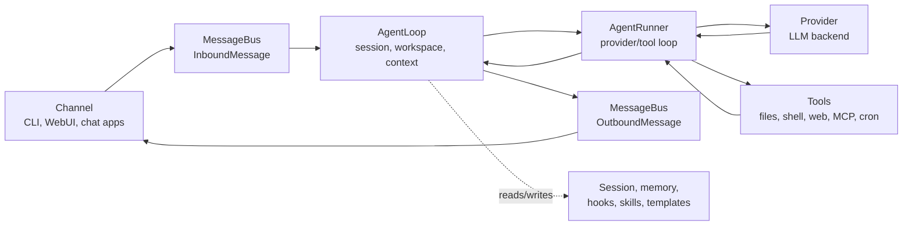

# 架构

本页将 nanobot 的运行时行为映射到源码文件。当你在调试内部机制、审查 PR、添加提供商/频道/工具，或试图理解某个用户可见行为的来源时，可以使用本页。

若想了解产品层面的心智模型，请先阅读 [`concepts.md`](./concepts.md)。

## 核心流程



主要文件：

| 领域 | 文件 |
|---|---|
| 消息事件与队列 | `nanobot/bus/events.py`, `nanobot/bus/queue.py` |
| 轮次编排 | `nanobot/agent/loop.py` |
| 提供商/工具对话循环 | `nanobot/agent/runner.py` |
| 上下文构建 | `nanobot/agent/context.py` |
| 会话存储与压缩 | `nanobot/session/manager.py` |
| 长期记忆与 Dream | `nanobot/agent/memory.py` |

## Agent Loop 与 Agent Runner

`AgentLoop` 负责面向频道的轮次：

- 接收入站消息；
- 确定生效的会话与工作区范围；
- 构建上下文；
- 接入钩子、进度以及频道元数据；
- 发布出站消息。

`AgentRunner` 负责面向模型的循环：

- 向选定的提供商发送消息；
- 处理流式增量与推理块；
- 执行工具调用；
- 将工具结果反馈给模型；
- 在生成最终答案或达到运行时上限时停止。

调试时请牢记这种分工。如果问题涉及频道路由、会话键、工作区选择或出站投递，从 `agent/loop.py` 入手。如果问题涉及提供商调用、工具调用、流式或迭代上限，从 `agent/runner.py` 入手。

## 提供商

提供商元数据集中在 `nanobot/providers/registry.py`。配置字段位于 `nanobot/config/schema.py`。

提供商选择使用：

- 显式的 `agents.defaults.provider` 或预设提供商；
- 提供商注册表关键字；
- API key 前缀与 API base URL 提示；
- 当配置了 `apiBase` 时的本地提供商回退；
- 对于能够路由多个模型系列的提供商，使用网关回退。

提供商实现位于 `nanobot/providers/`。大多数托管提供商使用 OpenAI 兼容实现，而 Anthropic、Azure OpenAI、AWS Bedrock、OpenAI Codex 与 GitHub Copilot 拥有专门的路径。

相关文档：

- [`providers.md`](./providers.md) 提供实用的搭建指南；
- [`configuration.md#providers`](./configuration.md#providers) 提供精确的提供商参考。

## 频道

频道将外部平台转换为 `InboundMessage` 事件，并将 `OutboundMessage` 事件发回平台。

主要文件：

| 领域 | 文件 |
|---|---|
| 频道基础契约 | `nanobot/channels/base.py` |
| 内置频道 | `nanobot/channels/*.py` |
| 发现与生命周期 | `nanobot/channels/manager.py` |
| WebSocket/WebUI 频道 | `nanobot/channels/websocket.py` |

频道通过内置模块扫描与插件入口点被发现。自定义频道应遵循 [`channel-plugin-guide.md`](./channel-plugin-guide.md)。

## WebUI 与网关

`nanobot gateway` 会启动：

- 已启用的聊天频道；
- 已配置时的 WebSocket 频道；
- 工作区范围的 cron 服务；
- 诸如 Dream 与心跳等系统作业；
- 位于 `gateway.port` 的健康检查端点。

打包后的 WebUI 由 WebSocket 频道提供，而非健康检查端点：

| 表面 | 默认值 |
|---|---|
| 健康检查端点 | `http://127.0.0.1:18790/health` |
| WebUI/WebSocket | `http://127.0.0.1:8765` |

WebUI 源码位于 `webui/`。生产构建输出到 `nanobot/web/dist/` 并被打包进 wheel。

相关文档：

- [`webui.md`](./webui.md) 提供 WebUI 用户指南；
- [`../webui/README.md`](../webui/README.md) 用于前端源码开发；
- [`websocket.md`](./websocket.md) 提供协议细节。

## 工具

工具从 `nanobot/agent/tools/` 与插件入口点被发现。

重要文件：

| 工具领域 | 文件 |
|---|---|
| 工具基类与 schema | `nanobot/agent/tools/base.py`, `nanobot/agent/tools/schema.py` |
| 发现 | `nanobot/agent/tools/registry.py` |
| Shell 执行 | `nanobot/agent/tools/shell.py` |
| 文件系统工具 | `nanobot/agent/tools/filesystem.py` |
| 网页搜索/抓取 | `nanobot/agent/tools/web.py` |
| MCP 工具 | `nanobot/agent/tools/mcp.py` |
| Cron | `nanobot/agent/tools/cron.py`, `nanobot/cron/` |
| 图像生成 | `nanobot/agent/tools/image_generation.py` |
| 运行时自省 | `nanobot/agent/tools/self.py` |

工具行为是模型契约的一部分。除非改动是有意为之，否则请保持用户可见的工具名、schema 与错误消息稳定。

## 配置与路径

配置 schema 位于 `nanobot/config/schema.py`。加载与保存位于 `nanobot/config/loader.py`。运行时路径辅助函数位于 `nanobot/config/paths.py`。

默认值：

| 路径 | 默认值 |
|---|---|
| 配置 | `~/.nanobot/config.json` |
| 工作区 | `~/.nanobot/workspace/` |
| 会话 | `<workspace>/sessions/*.jsonl` |
| 记忆 | `<workspace>/memory/` |
| Cron 存储 | `<workspace>/cron/jobs.json` |
| WebUI/媒体/日志运行时数据 | 配置目录下的子目录，例如 `webui/`、`media/` 与 `logs/` |

schema 同时接受 camelCase 与 snake_case 键，但保存配置时使用 camelCase 别名。

## 记忆与会话

会话历史是近期会话回放。记忆是更长期的工作区状态。

| 存储 | 文件位置 |
|---|---|
| 会话 JSONL 文件 | `<workspace>/sessions/` |
| 长期记忆 | `<workspace>/memory/MEMORY.md` |
| 巩固源历史 | `<workspace>/memory/history.jsonl` |
| 引导身份文件 | `<workspace>/SOUL.md`, `<workspace>/USER.md`, 以及 `nanobot/templates/` 下的模板 |

Dream 在 `nanobot/agent/memory.py` 中实现，并在启用时由运行时调度。

## 安全边界

涉及安全的代码路径包括：

| 边界 | 文件 |
|---|---|
| 工作区范围 | `nanobot/security/workspace_access.py`, `nanobot/security/workspace_policy.py` |
| Shell 沙箱 | `nanobot/agent/tools/shell.py` |
| SSRF/网络检查 | `nanobot/security/network.py`, `nanobot/agent/tools/web.py` |
| PTH 守卫与 CLI 启动安全 | `nanobot/security/` 与 CLI 入口点 |
| 频道访问控制 | `nanobot/channels/*.py` 中的频道配置 |

在修改工具、频道、文件访问、WebUI 工作区行为或网络抓取时，请将安全视为功能行为的一部分，并在用户可见边界发生变化时更新文档。

## 扩展点

| 扩展 | 方式 |
|---|---|
| 提供商 | 在 `providers/registry.py` 中添加 `ProviderSpec`，在 `config/schema.py` 中添加 schema 字段，仅当通用后端不够用时才实现提供商 |
| 频道 | 实现 `BaseChannel`，暴露入口点，遵循 [`channel-plugin-guide.md`](./channel-plugin-guide.md) |
| 工具 | 在 `agent/tools/` 下实现工具，或暴露插件入口点 |
| MCP | 添加 `tools.mcpServers` 配置 |
| 技能 | 在 `<workspace>/skills/` 下添加工作区技能文件，或在 `nanobot/skills/` 下添加内置技能 |

优先使用已有的注册表/发现模式，而非临时拼接。

## 测试与验证

常见检查：

```bash
pytest tests/test_openai_api.py::test_function -v
ruff check nanobot/
cd webui && bun run test
cd webui && bun run build
```

根据变更的表面选择测试：

| 变更 | 最小有用验证 |
|---|---|
| 提供商行为 | 提供商单元测试或 mock 的 API 路径；在可能时使用安全配置的 `nanobot agent -m "Hello!"` |
| 频道行为 | 频道测试加上 `nanobot gateway` 启动路径 |
| WebUI 行为 | WebUI 测试/构建，以及针对路由/设置/聊天变更，通过网关进行浏览器级验证 |
| 工具行为 | 工具单元测试，以及在 schema 或面向模型的行为变更时进行 agent 运行路径验证 |
| 文档 | 链接检查、命令与 CLI/schema 的准确性核对，以及 `git diff --check` |

对于面向用户的流程，最好至少通过用户实际触碰的公共表面走一次验证路径：CLI 命令、HTTP 端点、WebSocket/WebUI、聊天频道或打包后的导入。
