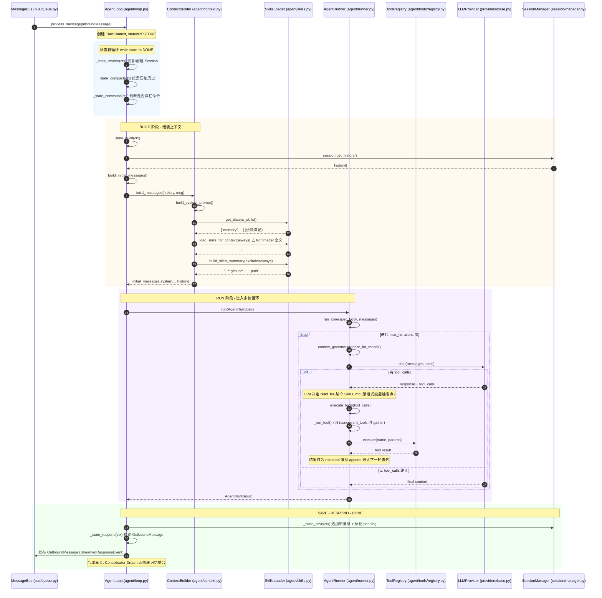

# SKILL 加载机制介绍

> 本文系统梳理 nanobot 的 Skill 机制：从加载解析、元数据约定，到渐进式披露与上下文配合，最后给出一个完整 turn 的调用链路序列图。

---

## 一、Skill 加载与解析机制

### 1.1 Skill 的物理结构

每个 skill 是一个**目录**，核心是 `SKILL.md` 文件，可附带 `scripts/`、`references/` 等辅助文件。示例：

```
nanobot/skills/github/
├── SKILL.md          # 唯一必需文件
└── scripts/          # 可选
```

### 1.2 SKILL.md 格式：YAML Frontmatter + Markdown Body

`SKILL.md` 由两部分组成，`nanobot/agent/skills.py:20` 的正则负责切分：

```python
_STRIP_SKILL_FRONTMATTER = re.compile(
    r"^---\s*\r?\n(.*?)\r?\n---\s*\r?\n?", re.DOTALL,
)
```

- **Frontmatter**（YAML）：元数据
- **Body**（Markdown）：给 agent 的使用指令

以 `nanobot/skills/github/SKILL.md` 为例：

```yaml
---
name: github
description: "Interact with GitHub using the `gh` CLI ..."
metadata: {"nanobot":{"emoji":"🐙","requires":{"bins":["gh"]},"install":[...]}}
---
# GitHub Skill
... 使用指令 ...
```

### 1.3 核心加载器：`SkillsLoader`（`nanobot/agent/skills.py:27`）

**两级目录扫描**（`nanobot/agent/skills.py:51`）：

```python
def list_skills(self, filter_unavailable: bool = True):
    skills = self._skill_entries_from_dir(self.workspace_skills, "workspace")
    workspace_names = {entry["name"] for entry in skills}
    if self.builtin_skills and self.builtin_skills.exists():
        skills.extend(
            self._skill_entries_from_dir(self.builtin_skills, "builtin", skip_names=workspace_names)
        )
```

关键逻辑：

- **优先级**：workspace skills（`<workspace>/skills/`）会**覆盖**同名 builtin skills（`nanobot/skills/`）—— 通过 `skip_names=workspace_names` 实现
- **发现机制**：遍历目录，检查 `SKILL.md` 是否存在（`_skill_entries_from_dir`）
- **禁用过滤**：`self.disabled_skills` 从配置排除特定 skill（`nanobot/agent/skills.py:67`）

### 1.4 元数据解析（`nanobot/agent/skills.py`）

`get_skill_metadata()`（:148）解析 YAML frontmatter。`_parse_nanobot_metadata()`（:120）处理 `metadata` 字段中的嵌套 `nanobot` / `openclaw` 命名空间，支持 **dict 或 JSON 字符串**两种形式（兼容性设计）：

```python
payload = data.get("nanobot", data.get("openclaw", {}))
```

`nanobot` 命名空间下的关键字段：

- **`requires.bins`**：依赖的 CLI 命令（用 `shutil.which()` 检测）
- **`requires.env`**：依赖的环境变量（用 `os.environ.get()` 检测）
- **`always`**：标记 skill 是否始终注入上下文（而非按需读取）
- **`install`**：声明该 skill 的安装方式（apt/brew）

### 1.5 可用性检查（`_check_requirements`，`nanobot/agent/skills.py:131`）

```python
def _check_requirements(self, skill_meta: dict) -> bool:
    requires = skill_meta.get("requires", {})
    return all(shutil.which(cmd) for cmd in requires.get("bins", [])) and all(
        os.environ.get(var) for var in requires.get("env", [])
    )
```

缺失依赖的 skill 不会被过滤掉，而是以 `(unavailable: ...)` 标注展示（见 `build_skills_summary`），agent 还可据此尝试用 apt/brew 安装。

---

## 二、Skill 元数据字段性质说明

> **结论**：`requires.bins` / `requires.env` / `always` 不是通用标准，是 nanobot（沿袭自 OpenClaw）自定义的元数据约定。

### 2.1 非标准、属于 nanobot/OpenClaw 私有约定

YAML frontmatter 本身是通用格式，但 `requires.bins` / `requires.env` / `always` 这些字段没有任何通用 spec（如 OpenAPI、JSON Schema）背书。它们是 nanobot 自己定义的语义，代码里只有 `nanobot/agent/skills.py` 一处消费。

依据：

- `skills.py:189` 注释明确写 `Extract nanobot/openclaw metadata`
- `nanobot/skills/README.md` 写明「skill 格式与元数据结构遵循 OpenClaw 约定以保持兼容」
- `_parse_nanobot_metadata()`（`skills.py:188`）从 `metadata.nanobot` 或 `metadata.openclaw` 命名空间提取——双命名空间就是为了与 OpenClaw 互通

### 2.2 字段分两层，作用域不同

| 字段 | 所在位置 | 作用域 | 用途 |
|------|----------|--------|------|
| `name`, `description`, `homepage` | frontmatter 顶层 | 通用展示 | 摘要里展示给 agent |
| `always` | frontmatter 顶层 **或** `metadata.nanobot` 内 | nanobot 私有 | 标记是否常驻上下文 |
| `requires.bins`, `requires.env` | `metadata.nanobot` 内 | nanobot 私有 | 依赖检查 |
| `emoji`, `os`, `install` | `metadata.nanobot` 内 | nanobot 私有 | UI/平台/安装提示 |

### 2.3 `always` 的双重兼容写法

`get_always_skills()`（`skills.py:226-229`）同时查两个位置：

```python
self._parse_nanobot_metadata(meta.get("metadata")).get("always")
or meta.get("always")
```

看实际样本就能理解为什么：

- `memory/SKILL.md` 把 `always: true` 写在 **frontmatter 顶层**
- `github/SKILL.md` 把 `requires` 放进 `metadata.nanobot` 内

nanobot 对两种写法都兼容，但**推荐放进 `metadata.nanobot`**（顶层 `always` 是向后兼容的宽松支持）。

### 2.4 `requires` 只检查存在性，不检查版本

`_check_requirements`（`skills.py:208`）用 `shutil.which()` / `os.environ.get()` 只判断「命令在 PATH 里」「环境变量非空」，**不校验版本号**。这是刻意保持简单的近似检查——比如 `gh` 只要存在就算可用，不管版本是否满足要求。

### 2.5 未被消费的声明性字段

`tmux/SKILL.md` 声明了 `"os":["darwin","linux"]`，但代码里**没有任何地方读取 `os` 字段**做平台过滤。这个字段目前是声明性元数据，未被框架消费——属于「声明了但未生效」的字段，调用方需知道它当前不参与可用性判断。

---

## 三、Skill 与 Tool 的关系

> **核心结论：Skill 不是 Tool。Skill 是"说明书"，Tool 是"手脚"。**

### 3.1 核心区分

| 维度 | Tool（工具） | Skill（技能） |
|------|-------------|---------------|
| 本质 | LLM 可直接调用的函数（function calling） | 给 LLM 阅读的**指令文档**（Markdown） |
| 注册位置 | `agent/tools/registry.py`（代码注册） | `agent/skills.py`（文件扫描） |
| 暴露给 LLM 的形式 | JSON Schema（name/parameters） | system prompt 里的文字摘要 |
| 执行方式 | 框架拦截 tool_call → 执行 Python 函数返回结果 | **不执行**，只靠 LLM 读完后「照着做」 |
| 物理形态 | `.py` 里的 `async def` + `@tool` 装饰器 | 目录里的 `SKILL.md` 文件 |

### 3.2 Skill 如何"生效"——靠 Tool，但不是 Tool 本身

关键证据在 `templates/agent/skills_section.md`：

> To use a skill, **read its SKILL.md file using the `read_file` tool**.

Skill 的使用链路：

```
1. system prompt 注入 skills summary（skill 名 + 描述 + 文件路径）
2. LLM 判断需要某 skill
3. LLM 调用 read_file 工具 → 读取 SKILL.md 全文      ← 这里用的是 tool
4. LLM 按 SKILL.md 里的指令操作（通常再调用其他 tool）
```

**Skill 是"知识/方法"，Tool 是"能力/动作"。** `SKILL.md` 本身不被注册为可调用函数，它的内容是通过 **filesystem 工具族（`read_file`）** 进入上下文的纯文本。

### 3.3 具体例子：github skill

以 `github/SKILL.md` 为例，它声明 `requires: bins: [gh]`。整个 skill 的运作方式：

1. 摘要阶段：system prompt 里出现 `- **github** — Interact with GitHub ...`
2. 触发：用户问「查一下 PR #55 的 CI 状态」
3. LLM 先 `read_file` 读 `github/SKILL.md`，看到指令 `gh pr checks 55 --repo owner/repo`
4. LLM 调用 **`exec`/`shell` 工具**（不是 skill 工具）执行这条 `gh` 命令
5. 框架执行 shell 命令，返回结果给 LLM

全程没有一个叫 `github` 的 tool 被调用。真正被调用的 tool 是 `read_file` 和 `shell`——skill 只是告诉 LLM 该调哪个 shell 命令。

### 3.4 例外：`always` skill 的特殊性

`always: true` 的 skill（如 `memory`）会**全文注入 system prompt**，连 `read_file` 这一步都省了，LLM 第一轮就能直接照做。但它依然不是 tool——它只是"预先读好的说明书"，执行时还是要落到具体的 tool。

---

## 四、渐进式披露与上下文配合

这是 nanobot skill 机制最核心的设计：**默认只给 agent 一份「摘要索引」，agent 需要时才用 `read_file` 工具加载完整内容**。这是对 token 预算的精细化管理。

### 4.1 三层注入策略（`ContextBuilder.build_system_prompt`，`nanobot/agent/context.py:71`）

```
系统提示 = 身份信息 + Bootstrap文件 + 工具契约 + Memory
         + [always skills 全文]      ← 第1层：始终加载
         + [skills summary 摘要]     ← 第2层：索引披露
         + recent history + summary
```

#### 第 1 层：Always Skills（全文注入）

`nanobot/agent/context.py:86-90`：

```python
always_skills = self.skills.get_always_skills()
if always_skills:
    always_content = self.skills.load_skills_for_context(always_skills)
    parts.append(f"# Active Skills\n\n{always_content}")
```

`get_always_skills()`（`skills.py:143`）筛选 frontmatter 中 `always=true` 且依赖满足的 skill，用 `load_skills_for_context()` **去 frontmatter 后注入全文**。

#### 第 2 层：Skills Summary（摘要索引，渐进式披露核心）

`nanobot/agent/context.py:92-94`：

```python
skills_summary = self.skills.build_skills_summary(exclude=set(always_skills))
if skills_summary:
    parts.append(render_template("agent/skills_section.md", skills_summary=skills_summary))
```

`build_skills_summary()`（`skills.py:83`）为每个 skill 生成**单行摘要**：

```markdown
- **github** — Interact with GitHub using the `gh` CLI ...  `/path/to/SKILL.md`
- **weather** — Get current weather and forecasts ...  `/path/to/SKILL.md`
- **tmux** — Remote-control tmux sessions (unavailable: CLI: tmux)  `/path/to/SKILL.md`
```

注入模板 `templates/agent/skills_section.md` 的关键指令：

> The following skills extend your capabilities. **To use a skill, read its SKILL.md file using the read_file tool.**

这一行就是渐进式披露的**契约**：agent 拿到的不是全文，而是「目录 + 描述 + 文件路径」，需要时自主决定调用 `read_file` 工具按需加载。

#### 第 3 层：按需加载（Agent 运行时）

当 agent 在对话中判断需要某 skill 时，通过 filesystem 工具的 `read_file` 读取对应路径的 `SKILL.md`。**这一步完全由 LLM 自主决策**，框架本身不做 skill-to-message 的绑定——这是「agent-driven」而非「rule-driven」的披露。

### 4.2 与上下文管理的配合

```
┌─────────────────────────────────────────────────┐
│ System Prompt (每轮重建)                          │
│  ├── identity / AGENTS.md / SOUL.md / USER.md    │  ← 静态，开销固定
│  ├── tool_contract                               │
│  ├── Memory (MEMORY.md)                          │
│  ├── Active Skills（always 全文）   ← 常驻 token   │
│  ├── Skills Summary（摘要索引）     ← 低 token     │  ← 渐进披露入口
│  └── Recent History（截断至 8000 tokens）         │
├─────────────────────────────────────────────────┤
│ History Messages                                 │
│  └── agent 此前 read_file 的 SKILL.md 内容        │  ← 按需进入历史
└─────────────────────────────────────────────────┘
```

关键配合点：

- **token 预算控制**：`always` skill 少量且全文；其余仅占摘要（每个 skill 一行）。`Recent History` 还有硬上限 `_MAX_HISTORY_TOKENS = 8000`（`context.py:31`）做兜底截断。
- **依赖状态感知**：不可用 skill 仍出现在摘要中并标注缺失原因（如 `unavailable: CLI: tmux`），agent 可据此触发安装流程，而非静默丢失能力。
- **workspace 覆盖机制**：用户可在 `<workspace>/skills/` 放同名目录定制 builtin skill，无需改源码——`list_skills` 中 `skip_names` 保证只加载 workspace 版本。

### 4.3 三层披露成本对比

| 层级 | 内容 | 注入时机 | Token 成本 |
|------|------|----------|-----------|
| Always Skills | SKILL.md 全文（去 frontmatter） | 每轮 system prompt | 高（常驻） |
| Skills Summary | name + description + path | 每轮 system prompt | 极低（每 skill 一行） |
| 按需加载 | 完整 SKILL.md | LLM 调用 `read_file` | 仅在需要时进入历史 |

这种「**目录披露 + 工具按需读取**」的模式，让 agent 在有限上下文窗口内感知到全部能力，又只在真正使用时付出 token 成本——是 token 经济性与能力可见性之间的优雅平衡，设计上承袭自 OpenClaw 的 skill 体系。

---

## 五、一个 Turn 的完整调用链路

### 5.1 文件 / 类 / 函数索引

| 阶段 | 文件 | 类 / 函数 | 职责 |
|------|------|-----------|------|
| ① 接入 | `bus/queue.py` | `MessageBus` | 解耦 channel 与 agent，投递 `InboundMessage` |
| ② 编排 | `agent/loop.py` | `AgentLoop._process_message` | turn 状态机入口 |
| ③ 状态机 | `agent/loop.py` | `TurnState` 枚举 + `_state_*` 处理器 | RESTORE→COMPACT→COMMAND→BUILD→RUN→SAVE→RESPOND→DONE |
| ④ 上下文构建 | `agent/loop.py` | `AgentLoop._state_build` + `_build_initial_messages` | 组装历史、memory、skills |
| ⑤ 系统提示 | `agent/context.py` | `ContextBuilder.build_system_prompt` / `build_messages` | 拼接 identity + skills 摘要 + history |
| ⑥ Skill 注入 | `agent/skills.py` | `SkillsLoader.get_always_skills` / `build_skills_summary` | always 全文 + 摘要索引 |
| ⑦ 执行循环 | `agent/runner.py` | `AgentRunner.run` → `_run_core` | 多轮 LLM ↔ tool 循环 |
| ⑧ 请求模型 | `agent/runner.py` | `AgentRunner._request_model` | 调用 `LLMProvider` |
| ⑨ 工具执行 | `agent/runner.py` | `AgentRunner._execute_tools` → `_run_tool` | 分批/并发执行 tool |
| ⑩ 工具注册 | `agent/tools/registry.py` | `ToolRegistry.execute` | 按名分发到具体 tool |
| ⑪ 持久化 | `agent/loop.py` | `AgentLoop._state_save` + `SessionManager` | 落盘历史、触发 Dream |

### 5.2 序列图



### 5.3 关键设计点解读

**状态机驱动，非线性流水线**
`_process_message`（`loop.py:1358`）是状态机循环器，通过 `_state_{NAME}` 动态分发（`loop.py:1418` 的 `getattr` 反射）。这使得 COMPACT、COMMAND 等阶段可条件跳过，异常时能从 checkpoint 恢复——这是与简单 `build → run → save` 线性流程的本质区别。

**Skill 的两个注入点都在 BUILD 阶段**
`_state_build` 调用 `_build_initial_messages` → `ContextBuilder.build_system_prompt`，期间两次访问 `SkillsLoader`：一次全文（always），一次摘要（其余）。之后整个 RUN 阶段不再直接触碰 SkillsLoader——skill 的"按需加载"完全由 LLM 在循环内通过调用 `read_file` 工具实现。

**工具执行的双层分发**
`AgentRunner._run_tool`（`runner.py:1134`）优先用 `prepare_call` 预解析，再落到 `ToolRegistry.execute`（`registry.py:186`）。`concurrent_tools=True`（`loop.py:929`）时同一批次用 `asyncio.gather` 并发，这是 nanobot 默认开启的工具并行执行能力。

**持久化与响应解耦**
`_state_save` 只追加新消息并标记 pending，真正的记忆整合（Dream）由 `Consolidator` 异步触发；响应在 SAVE 之后的 RESPOND 阶段才组装成 `OutboundMessage` 发布到 bus。这保证了即使后续持久化失败，用户也能先看到流式响应。
