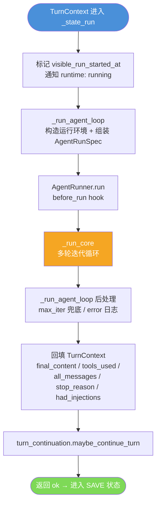
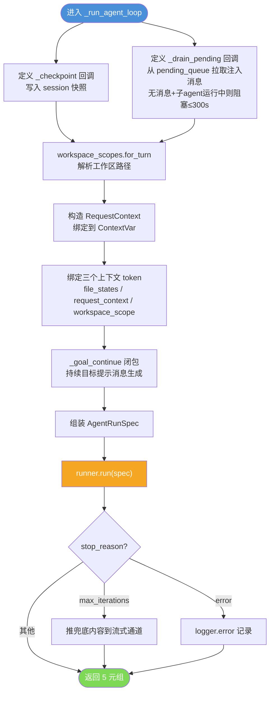
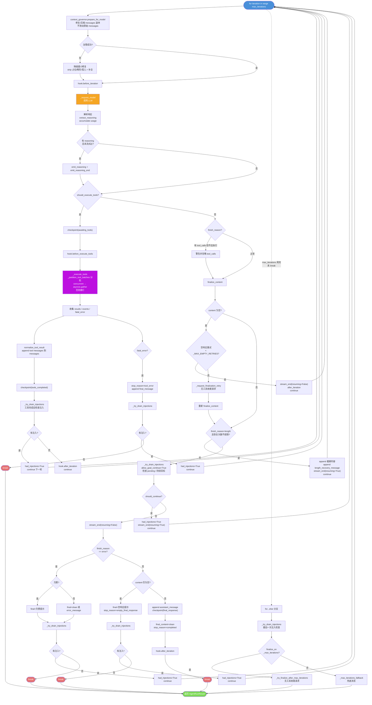
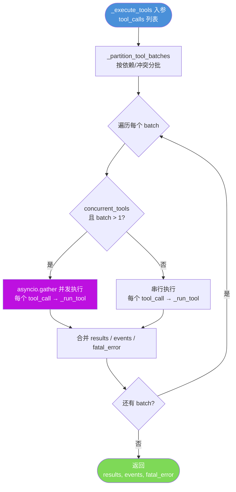
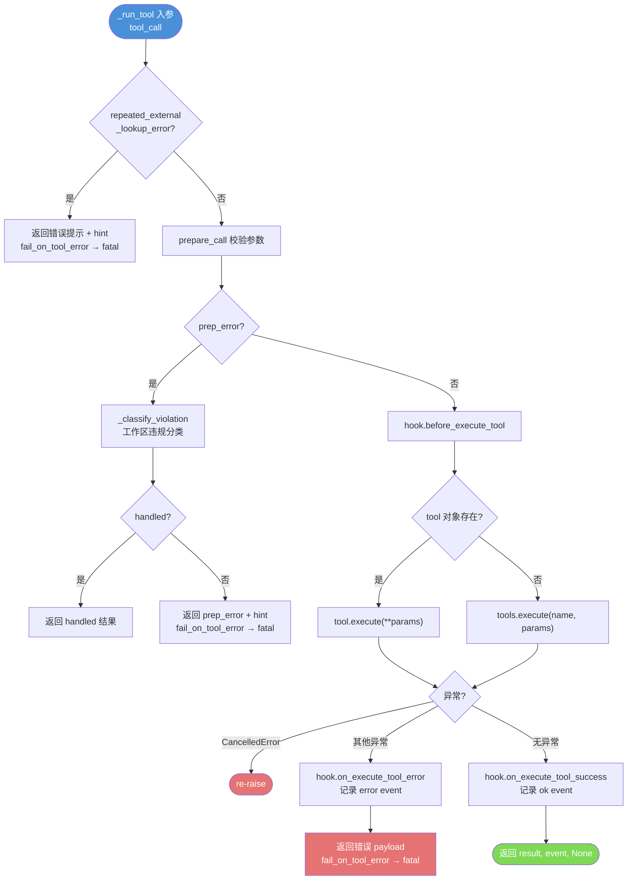
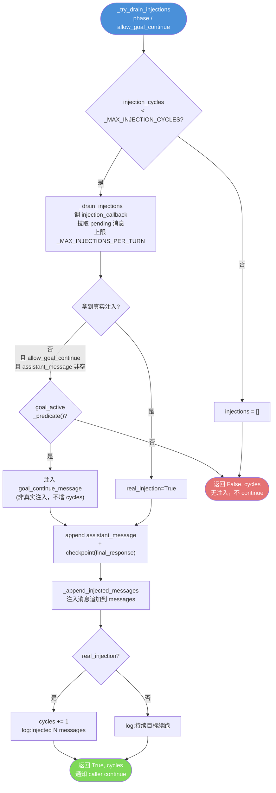
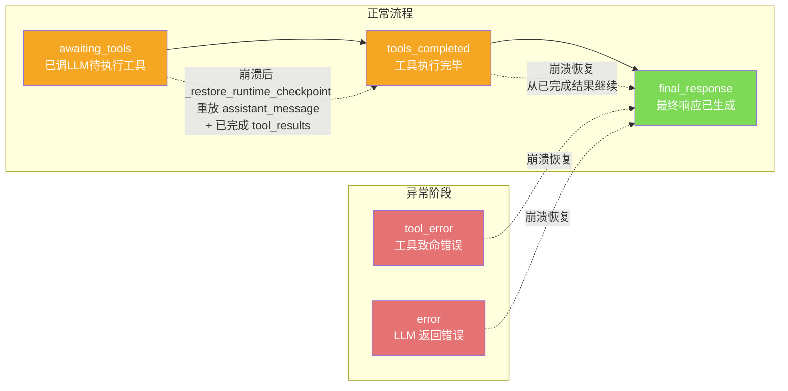

# `_state_run` 核心流程详解

> 源码位置：
> - `nanobot/agent/loop.py`（`_state_run` / `_run_agent_loop`）
> - `nanobot/agent/runner.py`（`AgentRunner.run` / `_run_core`）

## 分层调用结构

```
_state_run (loop.py:1635)                 状态机入口，标记运行开始、回填结果
  └─ _run_agent_loop (loop.py:760)        构造运行环境、绑定上下文、组装 spec
      └─ AgentRunner.run (runner.py:274)  hook 包装 + 异常兜底
          └─ _run_core (runner.py:338)    真正的多轮迭代循环
```

---

## 一、`_state_run`（状态机入口）

职责最薄，只做三件事：

1. 标记 `visible_run_started_at`，通知 runtime events 状态变为 `"running"`
2. 调 `_run_agent_loop(...)`，传入 BUILD 阶段产出的 `initial_messages`、runtime、tools、各类回调
3. 把返回的 `(final_content, tools_used, all_messages, stop_reason, had_injections)` 回填到 `TurnContext`，再调 `turn_continuation.maybe_continue_turn(ctx)` 判断是否续跑

---

## 二、`_run_agent_loop`（环境装配）

不碰对话内容，只负责"把一个干净的 spec 喂给 runner"。

**定义两个关键内部回调：**

| 回调 | 作用 |
|---|---|
| `_checkpoint(payload)` | 把当前对话快照写入 session，支持崩溃恢复 |
| `_drain_pending()` | 从 `pending_queue` 拉取后续消息（子 agent 结果、用户追加输入），作为注入消息塞回对话；无消息但有运行中子 agent 时阻塞等待（最多 300s） |

**绑定三个上下文 token**（`finally` 中 reset）：

- `bind_file_states` — 文件状态追踪
- `bind_request_context` — 请求级上下文（channel、chat_id、workspace、runtime）
- `bind_workspace_scope` — 工作区作用域

**持续目标（sustained goal）：** `_goal_continue()` 在 session metadata 存在目标时生成"请继续工作"提示消息，驱动长任务。

**组装 `AgentRunSpec` 关键参数：**

- `max_iterations`、`concurrent_tools=True`（工具并发）
- `checkpoint_callback`、`injection_callback`
- `goal_active_predicate`、`goal_continue_message`
- `llm_timeout_s`（由 session metadata 动态计算，持续目标允许更长）
- `finalize_on_max_iterations`（迭代耗尽时是否做无工具收尾请求）

**后处理：** `max_iterations` 时把兜底内容推给流式通道；`error` 时记日志。

---

## 三、`AgentRunner.run`（hook 包装）

用 try/except/finally 包住 `_run_core`，保证 hook 完整执行：

```
before_run → _run_core → after_run / on_error → on_finally
```

- `CancelledError` → `stop_reason="cancelled"` 后 re-raise
- 其他异常 → `on_error` 后 re-raise
- `finally` 里调 `on_finally`（异常时容错）

---

## 四、`_run_core`（真正的迭代循环）

核心结构：`for iteration in range(max_iterations)`，每轮做 **准备上下文 → 调用 LLM → 分支处理**。

### 每轮迭代详细步骤

**1. 上下文治理**（`context_governor.prepare_for_model`）

对 messages 副本做修复/压缩（剥离占位 assistant、修复畸形 tool_calls、丢弃孤儿 tool 结果、补全缺失结果），**不动原始 messages**，保证后续保存的 append 边界不变。治理失败时降级为最小修复。

**2. 调用 LLM**（`_request_model`）

发请求，拿到 `response`（含 content、tool_calls、reasoning、usage、finish_reason）。

**3. 分支 A — 需要执行工具**（`response.should_execute_tools`）

```
checkpoint(awaiting_tools)
  → before_execute_tools
  → _execute_tools（并发执行，_partition_tool_batches 分批）
  → 每个 tool 结果 normalize 后 append 到 messages
  → checkpoint(tools_completed)
  → drain 注入（工具完成后可能有子 agent 结果到达）
  → continue 下一轮
```

致命工具错误 → `stop_reason="tool_error"`，除非有注入否则 break。

**4. 分支 B — 无需工具（最终响应路径）**

按顺序检查：

- **空内容重试**：连续空响应最多 `_MAX_EMPTY_RETRIES` 次，超过则做一次 `_request_finalization_retry`
- **length 截断恢复**：`finish_reason="length"` 时追加恢复消息继续生成（最多 `_MAX_LENGTH_RECOVERIES` 次）
- **注入检查**（最终响应前）：drain pending 队列，有注入则保持流式不结束，继续循环
- **错误处理**：`finish_reason="error"` → 区分欠费（`_ARREARAGE_ERROR_MESSAGE`）/ 普通错误
- **正常完成**：append assistant message、checkpoint(final_response)、`break`

**5. 循环耗尽**（`for...else`）

`max_iterations` 用完未拿到最终响应：

- 最后再 drain 一次注入
- `finalize_on_max_iterations=True` → 无工具收尾请求（`_try_finalize_after_max_iterations`）
- 否则用兜底消息（`_max_iterations_fallback`）

### 返回值 `AgentRunResult`

| 字段 | 说明 |
|---|---|
| `final_content` | 最终文本（可能为 None） |
| `messages` | 完整对话历史（含本轮所有 append） |
| `tools_used` | 成功执行的工具名列表 |
| `usage` | 累计 token 用量 |
| `stop_reason` | completed / tool_error / error / empty_final_response / max_iterations / cancelled |
| `error` | 错误文本（无则 None） |
| `tool_events` | 每个工具的执行事件 |
| `had_injections` | 本轮是否消费了注入消息 |

---

## 五、关键设计点

- **工具并发**：`concurrent_tools=True`，一轮里的多个 tool_call 经 `_partition_tool_batches` 分批后用 `asyncio.gather` 并发
- **三类注入检查点**：工具执行后、最终响应前、错误/空响应后——保证 pending 消息不丢失、按序消费
- **checkpoint 四阶段**：`awaiting_tools` / `tools_completed` / `final_response` / 错误，支持崩溃恢复
- **上下文治理与持久化解耦**：给模型的 messages 可被压缩/修复，但写回 session 的原始 messages 保持 append-only
- **持续目标驱动**：`goal_active_predicate` + `goal_continue_message` 在循环中持续注入"请继续"提示

---

## 六、完整流程图

### 6.1 顶层分层调用



### 6.2 `_run_agent_loop` 环境装配



### 6.3 `_run_core` 迭代主循环（核心）



### 6.4 `_execute_tools` 工具执行细节



### 6.5 `_run_tool` 单个工具执行



### 6.6 `_try_drain_injections` 注入检查机制



### 6.7 运行时崩溃恢复（checkpoint 四阶段）


