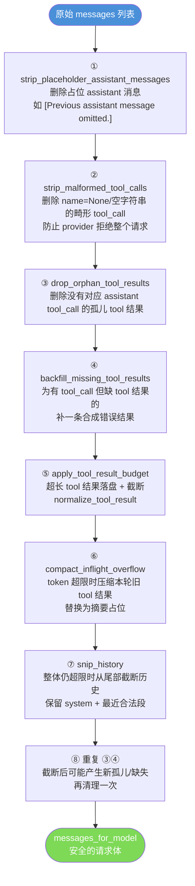
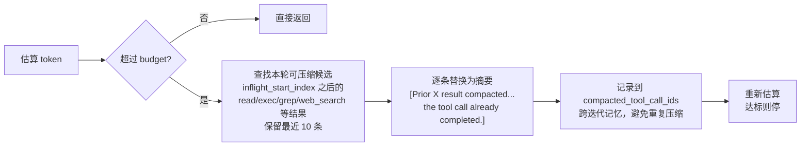
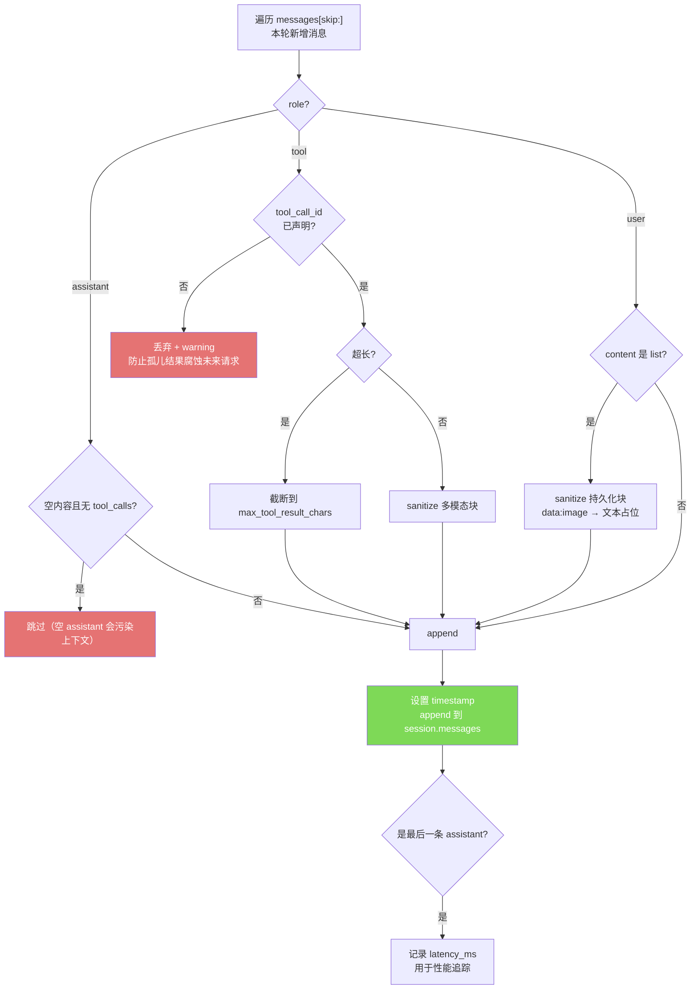
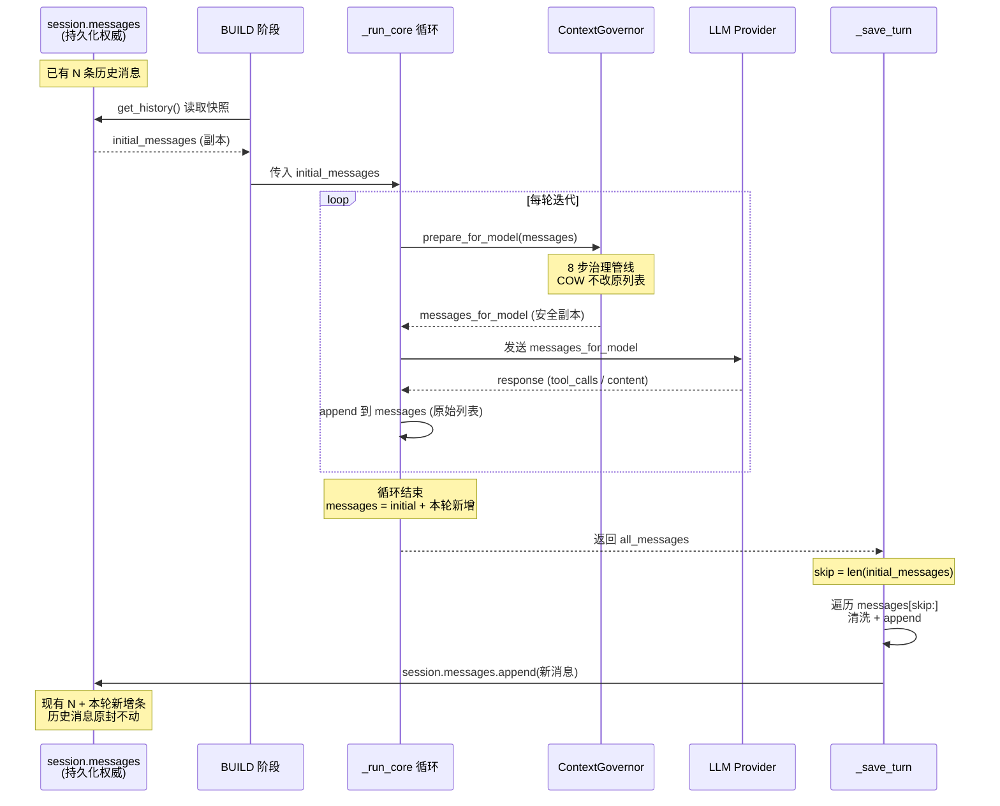

# 上下文治理与持久化解耦（messages_for_model vs session.messages）

> 源码位置：
> - `nanobot/agent/context_governance.py`（`ContextGovernor` 治理器）
> - `nanobot/agent/runner.py`（`_run_core` 消费治理后的副本）
> - `nanobot/agent/loop.py`（`_save_turn` 写回 session）

## 核心问题

Agent 的一次回合里，`messages` 列表同时承担两个矛盾的角色：

| 角色 | 需求 |
|---|---|
| **给 LLM 看的请求体** | 必须合法、不能超 token 上限、不能有畸形结构，否则 provider 直接报错 |
| **写回 session 的历史记录** | 必须是完整、真实、append-only 的对话原始流，是后续所有回合的权威数据源 |

如果用同一个列表同时满足两者，会陷入两难：

- 为了让 LLM 不报错，需要删掉畸形 tool_call、压缩超长 tool 结果
- 但这些"修复"如果污染了 session 历史，后续回合看到的就是被篡改的对话，丢失真实信息

nanobot 的解法是 **读路径（给模型）和写路径（持久化）完全隔离**。

---

## 一、双列表架构

```
┌─────────────────────────────────────────────────────────┐
│  session.messages  （持久化权威列表，append-only）        │
│  ← 由 _save_turn 只追加新消息，永不修改历史               │
└─────────────────────────────────────────────────────────┘
                        │
                        │ BUILD 阶段读取
                        ▼
┌─────────────────────────────────────────────────────────┐
│  initial_messages  （runner 的起始副本）                  │
│  = session.get_history(...) 的快照                       │
└─────────────────────────────────────────────────────────┘
                        │
                        │ _run_core 每轮迭代
                        ▼
┌─────────────────────────────────────────────────────────┐
│  messages_for_model  （治理后的请求体副本）               │
│  = ContextGovernor.prepare_for_model(messages, ...)      │
│  ← 可被修复/压缩/截断，但绝不写回 messages               │
└─────────────────────────────────────────────────────────┘
```

### 关键代码：两个列表的诞生

`_run_core` 每轮迭代：

```python
# runner.py:276 — runner.run 入口
messages = list(spec.initial_messages)   # 副本，后续只 append

# runner.py:352 — governance config 记录边界
governance_config = ContextGovernanceConfig(
    ...
    inflight_start_index=len(spec.initial_messages),  # ★ 标记"本轮新增"起点
)

# runner.py:355-365 — 每轮生成 model 副本
messages_for_model = self.context_governor.prepare_for_model(
    governance_config,
    messages,                  # ← 原始列表（只读传入）
    compacted_tool_call_ids,   # ← 跨迭代记忆
)
```

`messages_for_model` 是治理器**返回的新列表**，原始 `messages` 不受影响。注释明确写了：

> *"Context governance may repair or compact historical messages for the model,
> but those synthetic edits must not shift the append boundary used later
> when the caller saves only the new turn."*

---

## 二、messages_for_model 如何被治理（读路径）

`ContextGovernor.prepare_for_model`（`context_governance.py:92`）是一条**治理管线**，按顺序执行 8 步：

```python
def prepare_for_model(self, config, messages, compacted_tool_call_ids):
    updated = self.strip_placeholder_assistant_messages(messages)
    updated = self.strip_malformed_tool_calls(updated)
    updated = self.drop_orphan_tool_results(updated)
    updated = self.backfill_missing_tool_results(updated)
    updated = self.apply_tool_result_budget(config, updated)
    updated = self.compact_inflight_overflow(config, updated, compacted_tool_call_ids)
    updated = self.snip_history(config, updated)
    updated = self.drop_orphan_tool_results(updated)
    return self.backfill_missing_tool_results(updated)
```

### 管线流程图



### 每一步详解

**① `strip_placeholder_assistant_messages`**（`:150`）

删除内容为 `[Previous assistant message omitted.]` 且无 tool_calls 的 assistant 消息。这类占位消息是之前压缩留下的残骸，会让 LLM 困惑、重复尝试失败的工具调用。

**② `strip_malformed_tool_calls`**（`:187`）

删除 `name=None` 或 `name=""` 的畸形 tool_call。这类数据是旧版本 bug 遗留的，会让 provider 直接报错 `tool_use.name: Input should be a valid string`，永久卡死会话。删除后若 assistant 消息既无内容又无合法 tool_call，整条删除。

**③ `drop_orphan_tool_results`**（`:234`）

扫描所有 `role=tool` 消息，如果它的 `tool_call_id` 在前面的 assistant 消息里没有声明过，就删除。防止"孤儿结果"让 provider 困惑。

**④ `backfill_missing_tool_results`**（`:261`）

反向检查：如果 assistant 声明了 tool_call 但后面没有对应的 tool 结果，插入一条合成结果：

```python
{"role": "tool", "tool_call_id": cid, "name": name,
 "content": "[Tool result unavailable — call was interrupted or lost]"}
```

保证每个 tool_call 都有配对结果——这是多数 provider 的硬性要求。

**⑤ `apply_tool_result_budget`**（`:296`）

对每条 tool 结果调 `normalize_tool_result`：
- 超长结果落盘到工作区文件（`maybe_persist_tool_result`），内容替换为文件路径引用
- `read_file` 工具豁免（避免"落盘→读取→再落盘"死循环）
- 仍超 `max_tool_result_chars` 则截断

**⑥ `compact_inflight_overflow`**（`:314`）

这是**最精妙的一步**。先估算 token，超 `input_budget` 时才压缩：



关键：`compacted_tool_call_ids` 是一个 `set`，在多次迭代间传递，**已压缩过的 tool 结果不会再次压缩**，保证稳定性。

**⑦ `snip_history`**（`:371`）

前 6 步后仍超限时，从历史尾部截断：保留所有 system 消息 + 尽量多的近期非 system 消息，再用 `_legal_history_tail` 确保截断点合法（不能以 tool 结果开头）。

**⑧ 重复 ③④**

截断可能产生新的孤儿/缺失，再清理一次保证最终请求体结构完整。

### 治理的不可变原则

整个治理管线严格遵守模块文档首行声明：

> *"It may return copied messages or persisted-result placeholders,
> but it must not mutate an existing session history list in place."*

每个步骤的模式都是：**检测到需要修改时才复制**（`updated = [dict(m) for m in messages[:idx]]`），没问题时返回原列表。这是**写时复制（Copy-on-Write）**思想，避免无谓的深拷贝开销。

---

## 三、session.messages 如何被写回（写路径）

写回发生在 SAVE 阶段的 `_save_turn`（`loop.py:1767`）。核心设计：**只追加本轮新增消息，永不修改历史**。

### append-only 边界

```python
def _save_turn(self, session, messages, skip, *, turn_latency_ms=None):
    # messages = runner 返回的完整对话（含 initial_messages 前缀）
    # skip = initial_messages 的长度（即跳过历史，只保存本轮新增）

    for m in messages[skip:]:          # ★ 只遍历本轮新增部分
        entry = dict(m)
        ...
        session.messages.append(entry) # ★ 只 append，不修改已有消息
```

`skip` 的值来自 `ctx.save_skip`，而 `all_messages` = `initial_messages`（历史快照）+ 本轮新增，所以 `messages[skip:]` 精确切出**只有本轮产生的新消息**。

### 写回前的清洗（只作用于新消息）

虽然 append-only，但新消息本身也会做清洗，避免脏数据进入历史：



### 关键清洗逻辑

**空 assistant 跳过**（`:1797`）

```python
if role == "assistant" and not content and not entry.get("tool_calls"):
    continue  # skip empty assistant messages — they poison session context
```

**孤儿 tool 结果丢弃**（`:1800`）

```python
if role == "tool":
    tool_call_id = entry.get("tool_call_id")
    if not tool_call_id or str(tool_call_id) not in declared_tool_call_ids:
        logger.warning("Dropping orphaned tool result ...")
        continue
```

注意 `declared_tool_call_ids` 是动态维护的——初始从 session 历史 assistant 消息收集，本轮每 append 一条 assistant 消息就追加它的 tool_call id，保证后续 tool 结果能匹配。

**多模态落盘**（`_sanitize_persisted_blocks`，`:1748`）

`data:image/...` 这种内联 base64 图片不会写进历史，替换为文本占位引用，避免 session JSON 膨胀。

---

## 四、双路径协作全景



---

## 五、为什么这样设计——三个关键收益

### 1. 历史不可篡改

治理器为了喂给 LLM 会做"暴力"操作：删除畸形消息、压缩 tool 结果为摘要、截断历史。如果这些操作污染了 session，真实对话流就丢失了。

**解耦后**：session 永远保留原始完整记录，治理只在请求前的副本上发生。

### 2. append 边界稳定

`_save_turn` 依赖 `skip = len(initial_messages)` 来确定"哪些是本轮新增"。如果治理改了 messages 的长度或结构，这个边界就会错乱——可能重复保存历史消息，或丢失新消息。

**解耦后**：`messages`（原始）和 `messages_for_model`（治理后）是两个独立列表，`skip` 边界永远对齐原始列表。

### 3. 跨回合治理一致性

`compacted_tool_call_ids` 在单次回合的多次迭代间共享。如果治理直接改 session，下一回合读到的历史就是被压缩过的，会触发"压缩已被压缩的消息"，质量雪崩。

**解耦后**：每回合都从原始 session 重新治理，`compacted_tool_call_ids` 只在当前回合生效，历史保持干净。

---

## 六、可复用的设计模式

| 模式 | 代码体现 | 适用场景 |
|---|---|---|
| **读写分离** | `messages_for_model` vs `session.messages` | 缓存 vs 源数据、报表 vs 原始日志 |
| **写时复制（COW）** | 治理器只在检测到改动时才复制列表 | 不可变数据结构、函数式更新 |
| **管线式处理** | `prepare_for_model` 的 8 步链 | 数据清洗 ETL、中间件链 |
| **append-only 持久化** | `_save_turn` 只追加 | 事件溯源、审计日志、区块链 |
| **幂等标记跨轮记忆** | `compacted_tool_call_ids` | 避免重复操作的 memoization |
| **边界锚点** | `inflight_start_index` 区分历史 vs 本轮 | 增量处理、diff 计算 |
